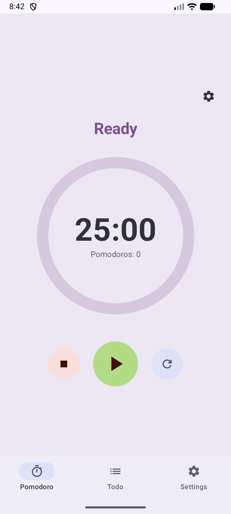
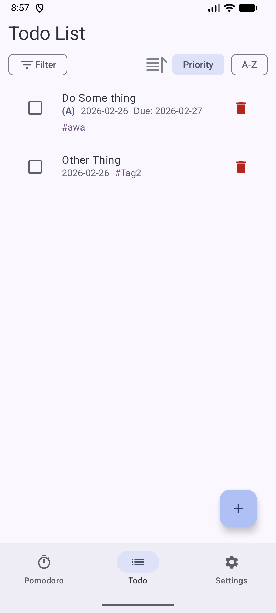

# Attention Tool

<div align="center">
  
</div>

A simple Android app , featuring Pomodoro timer and todo list management, for helping you stay focused on your tasks.

## Features

- Pomodoro Timer
- Todo List





## Build

```bash
./gradlew assembleDebug
```


## Troubleshooting

### Timer not running in background
- Grant "Background activity" permission for this app in system settings

### No notification sound
- Check notification sound settings in system preferences
- Ensure "Do Not Disturb" mode is off,or allow the app to show notifications in "Do Not Disturb" mode

### Notifications not appearing
- Grant "Notifications" permission when prompted
- Check battery optimization settings may restrict notifications

